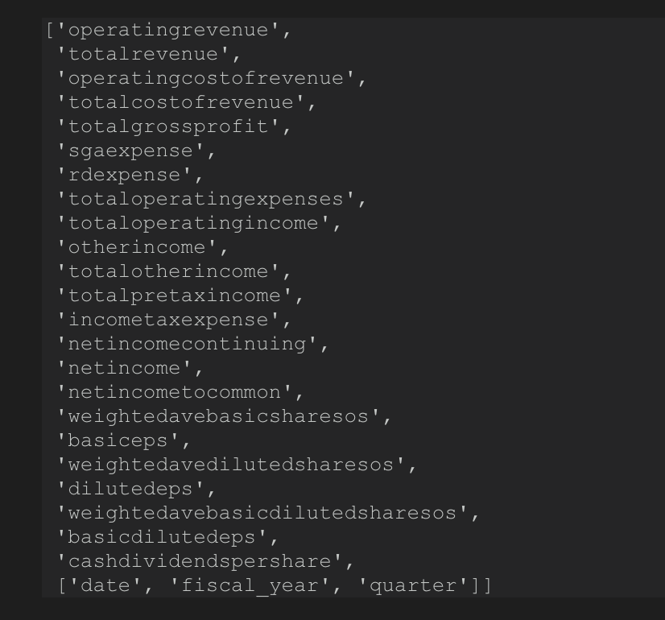
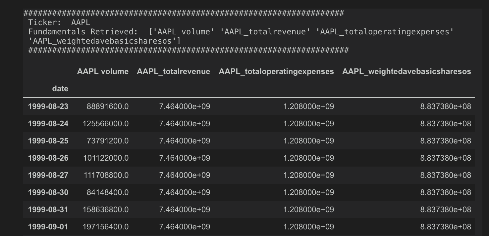

# Generating Daily Time Series With `fin_data`

The purpose of fin_data is to provide a simple yet flexible method for generating financial time series for the Investment Risk Analysis project for Lambda Labs. It relies on a series of API calls to create a data pipeline for model training.

Table of Contents
-----------

- [Getting Started](#Getting-Started)
    - [Importing the Ingestion Class](#Importing-the-Ingestion-Class)
    - [Development Environment](#Development-Environment)
    - [Environment Variables and Secrets](#Environment-Variables-and-Secrets)
    - [Create a DataFrame](#Create-a-DataFrame)
- [Additional Methods](#Additional-Methods)  
    - [add_securities()](#add_securities)  
    - [add_technicals()](#add_technicals)  
    - [add_macro()](#add_macro)  
    - [add_fundamentals()](#add_fundamentals)  

## Getting Started

This section covers the requirements for using the data ingestion class locally.

### Importing the Ingestion Class
It is necessary that your notebook is either working in the base repository for Investment Risk Analysis or the data folder. 
- If working in the base repository, the import will be `from data.fin_data import DailyTimeSeries`
- If working in the data folder, the import will be `from fin_data import DailyTimeSeries`

>_To change directory in a jupyter notebook, use `%` instead of `!`_

### Development Environment

There are several libraries that are necessary to use fin_data. Once modeling commences, a conda `environment.yml` will be established and maintained. Until then, here are the libraries that are necessary to run fin_data:

    alpha_vantage
    quandl
    python-decouple
    pandas
    numpy

### Environment Variables and Secrets

The API keys should be contained in a `.env` file located in the same directory as `fin_data`. The directory should also contain a .gitignore. These environment variables are then referenced using the `python decouple` module. To install the modele, run the following command in a your terminal.

    pip install python-decouple

**Do not commit the API keys to github!!!**.

Example .env file:

    #Environment variable assignments`

    INTRINIO_KEY = "api_key_here"
    ALPHA_VANTAGE = "api_key_here"
    QUANDL_KEY = "api_key_here"

> _It is essential that you are using the valid API keys and that the intrinio key is not the "sandbox key"_

### Create a DataFrame

To begin, import the DailyTimeSeries class from the fin_data.py file:  

    from fin_data import DailyTimeSeries

From there you need to create the class object. The class object is used to store a number of attributes necessary for the data acquisition methods. To create the class object, you need to provide a security symbol as a parameter.

    apple = DailyTimeSeries('AAPL')

This example object will focus on Apple, so that when you call other fundamnetals or technical indicators, that attribute will be included. From there, call the `initiate()` method. This will return a dataframe based on available pricing for the company referenced when creating the class object.

    df = apple.initiate()

From here, you can judiciously add other financial information to your dataframe.

## Additional Methods

These methods are the meat of fin_data. It ingests data from API calls and merges them to the given dataframe with an inner merge on the datetime index. In cases where the new data is relatively sparse, it may significantly reduce the total amount of data in the dataset. **Some methods are still in development.**

### add_securities()

Adds price history from a list of securities and merges that data with
the existing dataframe. Only accepts a list of securities. Requires two parameters, **list of security tickers** and a **Pandas DataFrame to merge newly acquired data to.**

    new_symbols = ['XLK', 'vix', 'SPX']

    df = apple.add_securities(symbols=new_symbols,
                              primary_df=df)

### add_technicals()

Adds technical indicators from a list of securities and merges that data with the existing dataframe. Requires two parameters, **list of technical indicators** and a **Pandas DataFrame to merge newly acquired data to.** Allows an additional parameter supp_symbol. This refers to a supplimentary security symbol that provides the user with flexibility as to which company or index the technical indicator is being analyzed. This symbol must be a recognized security symbol.

    techs = ['midpoint', 'mama', 'mfi', 'sma']

    df = apple.add_technicals(tech_symbols=techs,
                              primary_df=df)

Below is a table of Technical Indicators and the associated abbreviations to be used when calling the **_add_technicals()_** method. Further information can be found [here](https://www.alphavantage.co/documentation/).

| Technical Indicator | API Input Abbreviation |
| --------------------| ------------ |
| Simple Moving Average   | SMA       |
| Exponential Moving Average   | EMA        |
| Weighted Moving Average      | WMA       |
| Double Exponential Moving Average   | DEMA        |
| Triple Exponential Moving Average      | TEMA       |
| Triangular Moving Average   | TRIMA        |
| Kaufman Adaptive Moving Average      | KAMA       |
| MESA Adaptive Moving Average   | MAMA        |
| Volume Weighted Average Price       | VWAP       |
| Triple Exponential Moving Average   | T3        |
| Moving Average Convergence / Divergence      | MACD       |
| Moving Average Convergence / Divergence with Controllable Moving Average Type   | MACDEXT        |
| Stochastic Oscillator      | STOCH       |
| Stochastic Fast   | STOCHF        |
| Relative Strength Index      | RSI       |
| Stochastic Relative Strength Index   | STOCHRSI        |
| Williams %R      | WILLR       |
| Average Directional Movement Index     | ADX       |
| Par Average Directional Movement Index Ratingagraph   | ADXR |
| Absolute Price Oscillator   | APO        |
| Percentage Price Oscillator      | PPO       |
| Momentum   | MOM        |
| Balance of Power      | BOP       |
| Commodity Channel Index   | CCI        |
| Chande Momentum Oscillator      | CMO       |
| Rate of Change   | ROC        |
| Rate of Change Ratio      | ROCR       |
| Aroon Values   | AROON        |
| Aroon Oscillator   | AROONOSC        |
| Money Flow Index      | MFI       |
| One-Day Rate of Change of a Triple Smooth Exponential Moving Average   | TRIX        |
| Ultimate Oscillator      | ULTOSC       |
| Directional Movement Index   | DX        |
| Minus Directional Indicator      | MINUS_DI       |
| Plus Directional Indicator   | PLUS_DI        |
| Minus Directional Movement      | MINUS_DM       |
| Plus Directional Movement   | PLUS_DM        |
| Bollinger Bands      | BBANDS       |
| Midpoint Values   | MIDPOINT        |
| Midpoint Price Values   | MIDPRICE        |
| Parabolic SAR Values   | SAR        |
| True Range Values      | TRANGE       |
| Average True Range   | ATR        |
| Normalized Average True Range      | NATR       |
| Chaikin A/D Line   | AD        |
| Chaikin A/D Oscillator      | ADOSC       |
| On Balance Volume   | OBV        |
| Hilbert Transform - Instantaneous Trendline      | HT_TRENDLINE       |
| Hilbert Transform - Sine Wave   | HT_SINE        |
| Hilbert Transform - Trend vs. Cycle Mode   | HT_TRENDMODE        |
| Hilbert Transform - Dominant Cycle Period      | HT_DCPERIOD       |
| Hilbert Transform - Dominant Cycle Phase   | HT_DCPHASE        |
| Hilbert Transform - Phasor Components     | HT_PHASOR       |

### add_macro()

Adds macroeconomic indicators from a list of indices and merges that
data with the existing dataframe. Requires two parameters, **a list of macroeconomic indicators** and a **Pandas DataFrame to merge newly acquired data to.** The list of macroeconomic indicators being passed to the `indices` parameter must contain the API inputs in the table below, or else an error will be returned.

    indices = ['confidence_index','trade_index', 'longterm_rates']

    df = apple.add_macro(primary_df=df, 
                         indices=indices)

| Macroeconomic Indicator | API Input text | Indicator Description  
| --------------------| ------------ | ------------ |
| [Nominal Home Price Index](https://www.quandl.com/data/YALE/NHPI-Historical-Housing-Market-Data-Nominal-Home-Price-Index)   | housing_index    | The Nominal Home Price Index is a measurement of changes over time in the contractors' selling prices of new residential houses. It is recorded on a monthly basis and covers single homes, semi-detached homes and townhouses.
| [Investor Confidence](https://www.quandl.com/data/YALE/US_CONF_INDEX_VAL_INDIV-Stock-Market-Confidence-Indices-United-States-Valuation-Index-Data-Individual)   | confidence_index     | The Investor Behavior Project at Yale University, under the direction of Dr. Robert Shiller since its beginning and now under the auspices of the Yale International Center for Finance, has been collecting questionnaire survey data on the behavior of US investors since 1984. Among the studies that this project has produced was a major study of investor thinking on the day of the stock market crash of 1987. As part of this project, regular questionnaire investor attitude surveys have been done continuously since 1989. The following reports on some stock market confidence indexes derived from this survey data. These indexes have a span of nearly twelve years, and thus are the longest-running effort to measure investor confidence and related investor attitudes.
| [Trade Weighted U.S. Dollar Index: Broad](https://www.quandl.com/data/FRED/TWEXB-Trade-Weighted-U-S-Dollar-Index-Broad)   | trade_index    | A weighted average of the foreign exchange value of the U.S. dollar against the currencies of a broad group of major U.S. trading partners.
| [US Treasury Bond Long-Term Rates](https://www.quandl.com/data/USTREASURY/LONGTERMRATES-Treasury-Long-Term-Rates)   | longterm_rates    | The index is the unweighted average of bid yields on all outstanding fixed-coupon bonds neither due nor callable in less than 10 years.
| [US Treasury Bond Short-Term Rates](https://www.quandl.com/data/USTREASURY/BILLRATES-Treasury-Bill-Rates)   | shortterm_rates    | Records the daily secondary market quotation on the most recently auctioned treasury bills for multiple different maturity time frames: 4weeks, 8 weeks, 13 weeks, 26 weeks, and 52 weeks.

### add_fundamentals()

Adds company fundamentals and merges them to an existing dataframe. Requires two parameters, **list of company fundamentals** and a **Pandas DataFrame to merge newly acquired data to.** Allows an additional parameter supp_symbol. This refers to a supplimentary security symbol that provides the user with flexibility as to which company the fundamental is from. This symbol must be a recognized company symbol.

The available fundamentals differ by company, so a standaridzed list will work. To find a list of fundamentals for a company, use the `list_available_fundamentals()` method.

    apple.list_available_fundamentals()

It is best practice to view the results before passing the whole list into the add_fundamentals method. In some cases, the API returns a nested list as above.

    fund_list = ['totalrevenue',
                 'totaloperatingexpenses',
                 'weightedavebasicsharesos']

    apple.add_fundamentals(primary_df=df, 
                           fundamentals_list=fund_list)

